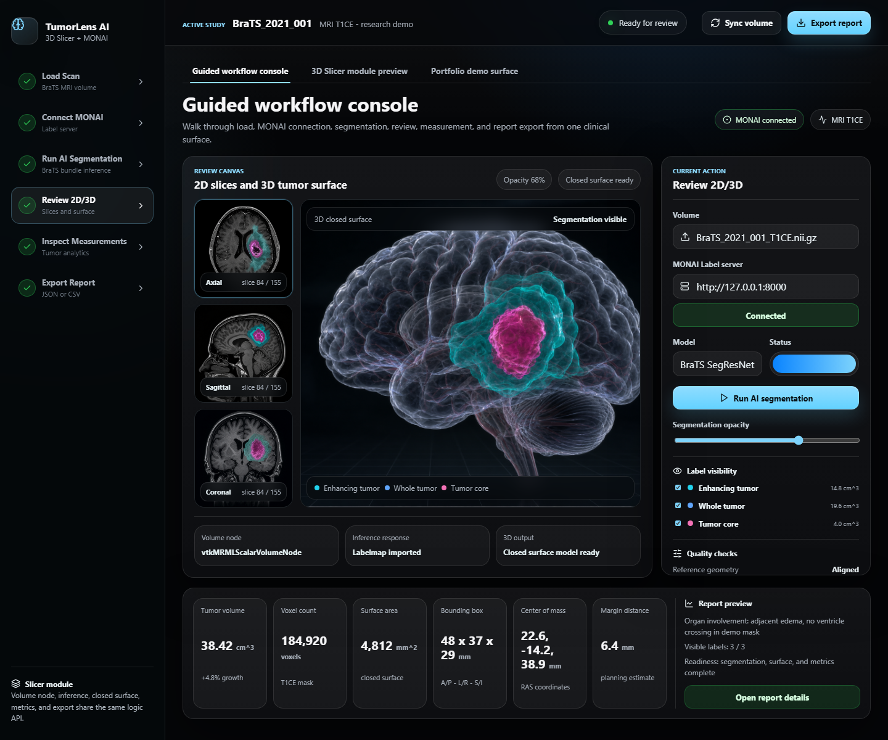
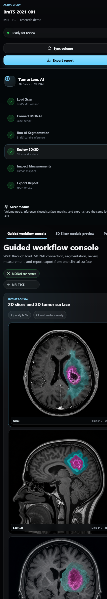
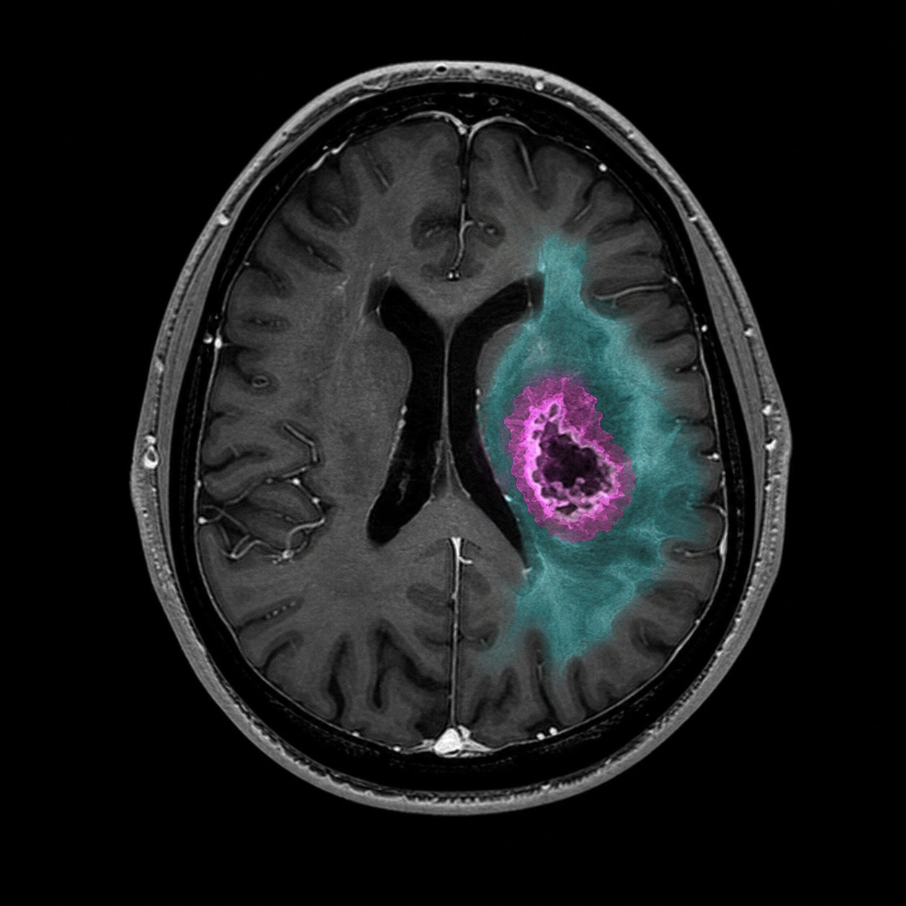
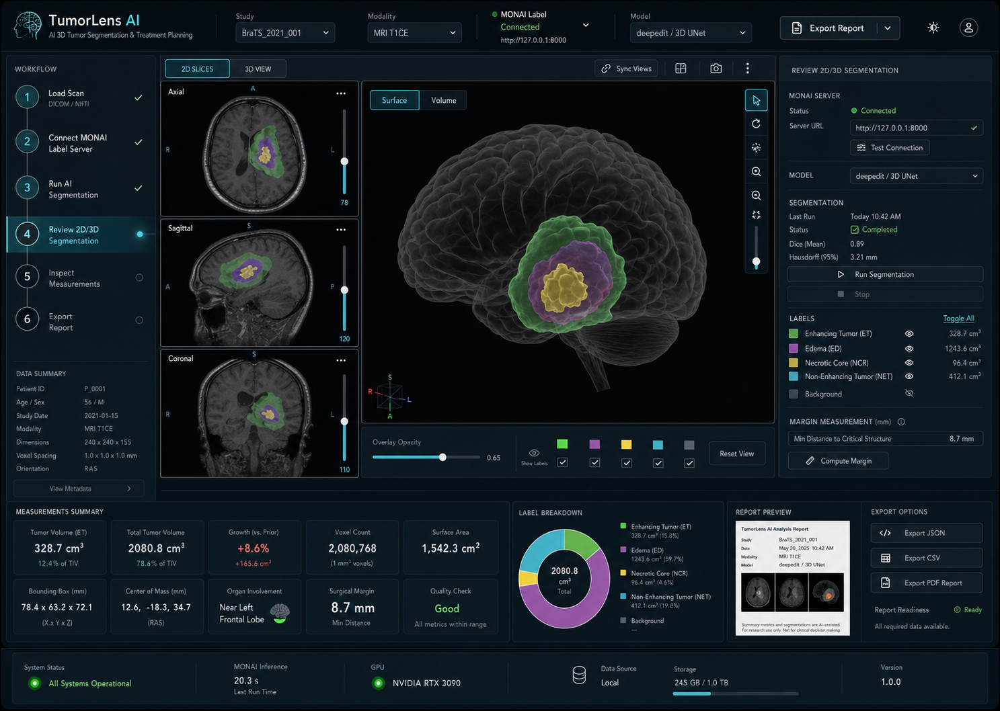

# TumorLens AI

TumorLens AI is a starter 3D Slicer extension for research and education workflows around AI-assisted brain tumor MRI segmentation. It is designed to show credible medical imaging engineering skills: Slicer/MRML workflow orchestration, MONAI Label integration, 3D segmentation surfaces, and quantitative tumor measurements.

This project is not a medical device and does not provide diagnosis, treatment advice, or clinical decision support.

## Screenshots

### Web Demo Interface



### Responsive View



### Imaging And 3D Output Visuals

| MRI review canvas | 3D tumor surface | Combined workflow concept |
| --- | --- | --- |
|  |  |  |

## What It Does

- Loads MRI volumes into 3D Slicer.
- Connects to a separately running MONAI Label server.
- Requests AI segmentation for a selected volume.
- Imports predicted labelmaps as Slicer segmentation nodes.
- Creates closed-surface 3D representations.
- Computes tumor measurements:
  - volume in `cm^3`
  - voxel count
  - bounding box dimensions
  - center of mass
  - approximate surface area
  - label breakdown
- Exports measurement reports as JSON or CSV.

## Project Structure

```text
TumorLensAI/
  TumorLensAI/
    TumorLensAI.py
    TumorLensAILogic.py
    TumorLensAIMetrics.py
    TumorLensAIMONAIClient.py
    Resources/
      UI/
      Icons/
  monai_app/
    README.md
    config/
  sample_data/
    README.md
  tests/
```

## Development Setup

The code is split so pure-Python pieces can be tested without launching 3D Slicer.

```bash
powershell -ExecutionPolicy Bypass -File scripts/setup_dev.ps1
powershell -ExecutionPolicy Bypass -File scripts/run_tests.ps1
```

To load the extension in 3D Slicer during development:

```bash
powershell -ExecutionPolicy Bypass -File scripts/find_slicer.ps1
powershell -ExecutionPolicy Bypass -File scripts/launch_slicer.ps1
```

The launch script opens 3D Slicer with this extension's module folder added. You can also add `TumorLensAI/TumorLensAI` manually from `Edit > Application Settings > Modules`.

## Web Demo Prototype

The portfolio demo is a React/Vite walkthrough of the TumorLens AI workflow: load scan, connect MONAI Label, run segmentation, review 2D/3D output, inspect measurements, and export a report.

```bash
npm install
npm run dev
```

Open the printed local URL, usually `http://127.0.0.1:5173/`.

## MONAI Label Server

TumorLens AI expects MONAI Label to run separately, usually at:

```text
http://127.0.0.1:8000
```

Example server startup:

```bash
powershell -ExecutionPolicy Bypass -File scripts/setup_monai.ps1
powershell -ExecutionPolicy Bypass -File scripts/download_monai_radiology_app.ps1
powershell -ExecutionPolicy Bypass -File scripts/download_monai_brats_bundle.ps1
powershell -ExecutionPolicy Bypass -File scripts/create_synthetic_study.ps1
powershell -ExecutionPolicy Bypass -File scripts/start_monai_server.ps1 -StudiesPath sample_data/synthetic_brain_mri/imagesTr -UseBrainTumorBundle
```

The `-UseBrainTumorBundle` flag stages the downloaded `MONAI/brats_mri_segmentation` bundle into the local MONAI Label radiology app and exposes the `brats_mri_segmentation` model through `/info`.

See `monai_app/README.md` for more setup notes.

## Public Logic API

The main orchestration class is `TumorLensAILogic`.

```python
loadVolume(path) -> volumeNode
connectMonaiServer(url) -> ServerStatus
runSegmentation(volumeNode, modelName) -> segmentationNode
createClosedSurface(segmentationNode) -> modelNode
computeTumorMetrics(volumeNode, segmentationNode) -> MeasurementReport
exportReport(report, outputPath) -> None
```

## Dataset Direction

The recommended starter dataset is the public Medical Segmentation Decathlon `Task01_BrainTumour` dataset or another BraTS-style public MRI dataset. Do not use private patient data for demos.

For local setup checks, use the generated synthetic study:

```bash
powershell -ExecutionPolicy Bypass -File scripts/create_synthetic_study.ps1
```
